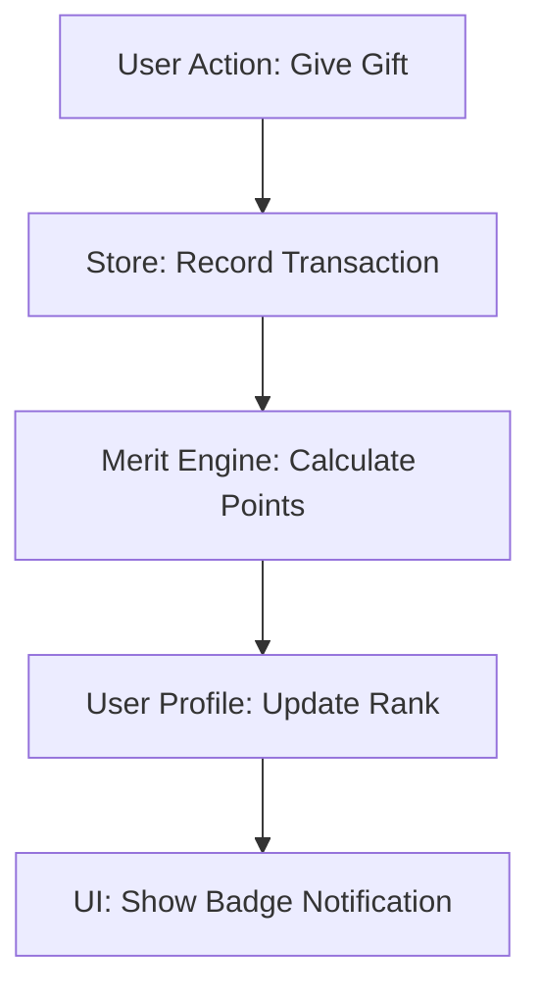

# Phase [XX] Implementation Plan: [Tech Name] (Lechite Name)

> **Context**: How this module (e.g., Phase 15 Merit Ledger) integrates with the whole `Supreme Architecture`. What existing stores does it touch? What new entities does it create?
> **Standard**: Compliance with `docs/templates/STANDARD_TECH_STACK.md` is MANDATORY.

## 1. Slavoarian Lexicon (The Language)
| Term | Lechite Term | Description |
| :--- | :--- | :--- |
| Reputation | **Zasługa** | The measure of a citizen's contribution to the community. |
| Merit Log | **Księga Czynów** | The immutable ledger of all good deeds. |
| Badge | **Odznaka** | A visual token of skill mastery (e.g., 'Mistrz Płodozmianu'). |

## 2. Technical Strategy (The Architecture)
*   **Store Choice**: Why `useUserStore` vs `useWorldStore`?
    *   *Decision*: Use a dedicated `useMeritStore` to isolate heavy ledger logic from light user profile data.
*   **Data Model**: Interface definition (`interface Zasluga`).
    *   *Example*: `interface Zasluga { id: string, type: 'Czyn' | 'Dar', value: number, timestamp: string }`
*   **Persistence**: `IndexedDB` vs `LocalStorage`.
    *   *Reasoning*: Use `IndexedDB` because the ledger can grow to 10,000+ entries.
*   **Tech Stack Compliance**:
    *   [ ] Frontend: React 18 + TS 5.
    *   [ ] State: Zustand (Persistent).
    *   [ ] Styling: Tailwind + Framer.

## 3. Invariants (The Unbreakables)
*   **Invariant I**: A user cannot award *themselves* merit points.
*   **Invariant II**: The sum of all `Zaslugi` must equal the user's `Total Reputation`.
*   **Invariant III**: A `DarZiemi` (Resource) cannot be deleted if a `Przymierze` (Contract) is active on it.

## 4. Failure Modes & Mitigations (The Risks)
| Risk | Impact | Mitigation |
| :--- | :--- | :--- |
| Network Split | High | Use Vector Clocks for merge conflicts; prefer "Union" strategy for merits. |
| Spam Attack | Medium | Rate limit: max 1 merit per minute per user pair. |
| Data Corruption | Critical | Store a rolling SHA-256 hash of the ledger to detect tampering. |

## 5. Implementation Tasks (Micro-Steps)
### 5.1 [Component A: The Ledger UI]
*   [ ] Task 1.1: Build `MeritTable` component with virtualization (react-window).
*   [ ] Task 1.2: Implement `MeritFilter` (By time, by type).
*   [ ] Task 1.3: Add "Export to CSV" button for transparency.

### 5.2 [Logic B: The Calculation Engine]
*   [ ] Task 2.1: Write `calculateTotalReputation(zaslugi: Zasluga[])` pure function.
*   [ ] Task 2.2: Add unit tests for integer overflow edge cases.
*   [ ] Task 2.3: Wire up `useMeritStore` actions (`addZasluga`, `removeZasluga`).

## 6. Dependency Graph (The Flow)

## 7. Success Contract (Definition of Done)
*   [ ] Invariant I is verified by a focused unit test.
*   [ ] UI renders 10,000 log entries < 16ms (60fps scrolling).
*   [ ] Zero "Ghost Merits" created during rapid-fire clicks.
